# devsecops-pipeline


Step 1: Launch EC2 (Ubuntu 22.04):

- First, you'll have an EC2 instance running Ubuntu 22.04 with Jenkins, SonarQube, and Docker installed and configured. This setup will enable you to use Jenkins for CI/CD, SonarQube for code quality analysis, and Docker for containerized deployments.


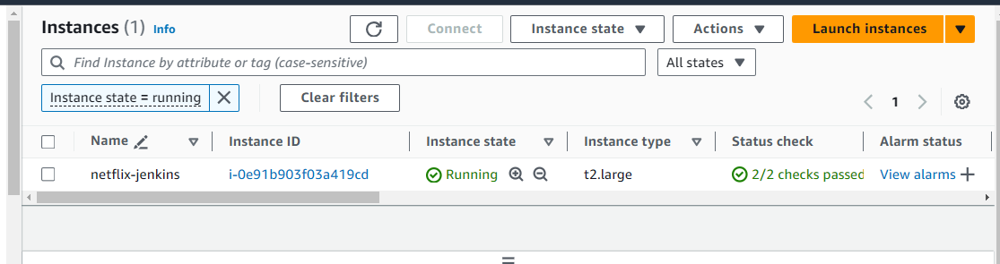

Next, create an Elastic IP and attach it to the EC2 instance you created. This will ensure the instance retains the same IP address whenever it is stopped and started.

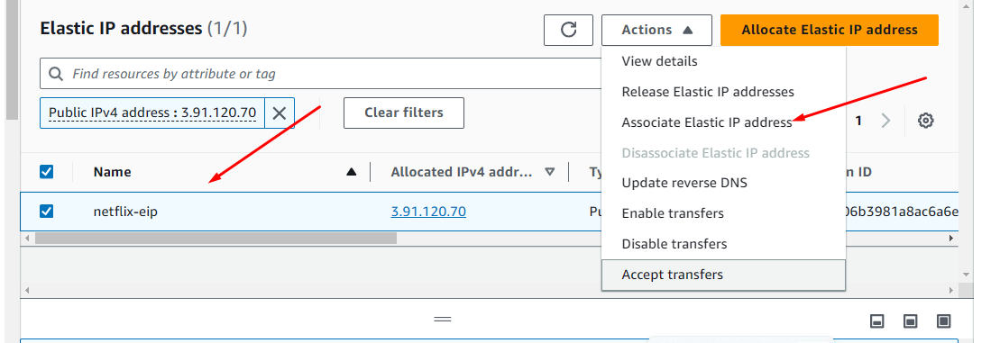

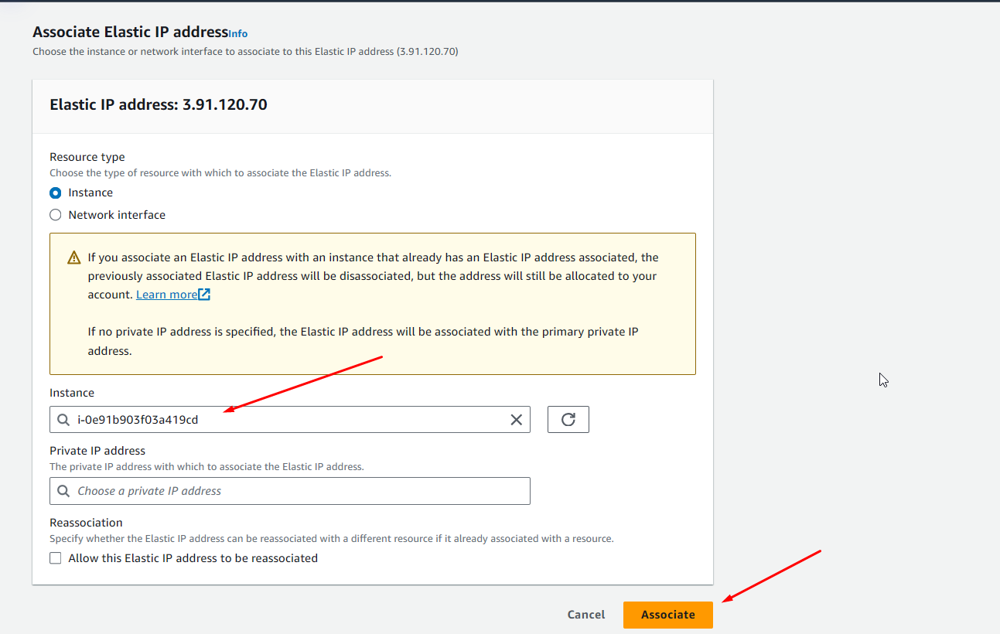

Now, Connect to the instance using SSH.

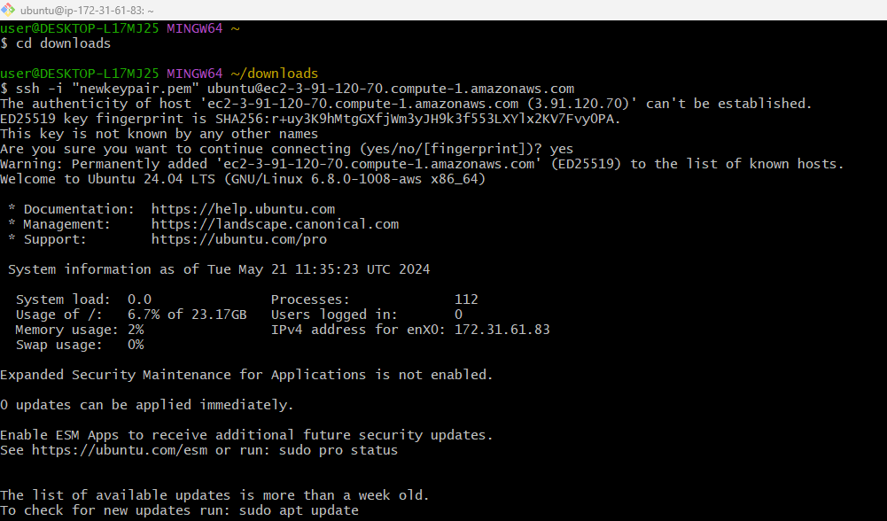

Clone the code that you will use for the project.

Run `git clone https://github.com/N4si/DevSecOps-Project.git`

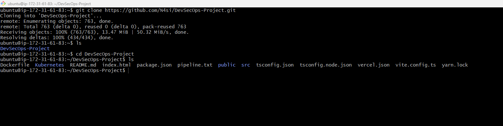

Run `sudo apt-get update` to update all the packages.

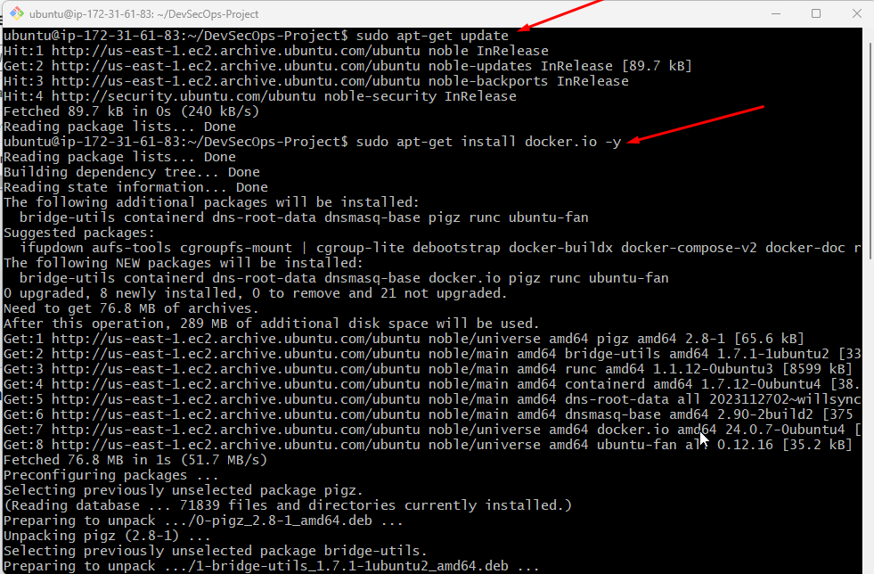

### Install Docker and Run the App using a Container

On the EC2 instance, you will set up Docker by running the following script:

```
sudo apt-get install docker.io -y
sudo usermod -aG docker $USER  # Replace with your system's username, e.g., 'ubuntu'
newgrp docker
sudo chmod 777 /var/run/docker.sock
```

Then build and run your application using Docker containers:

```
docker build -t netflix .
docker run -d --name netflix -p 8081:80 netflix:latest

#to delete
docker stop <containerid>
docker rmi -f netflix
```

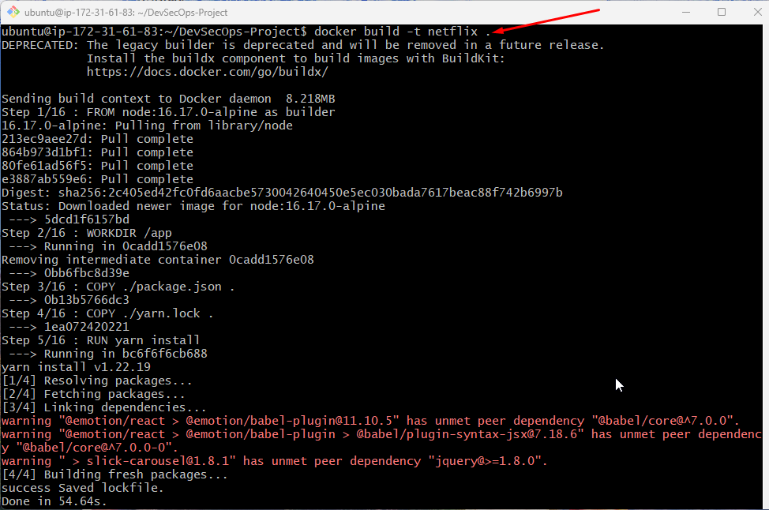

Run `docker images` to view a list of created images. You will see that the image was built successfully.

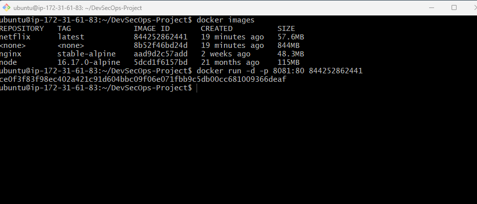

Next, to ensure that you have access to Jenkins, SonarQube, and your app, open the security groups. 

- The application is running on port **8081**.
- Jenkins on port **8080.**
- Sonarqube on port **9000**

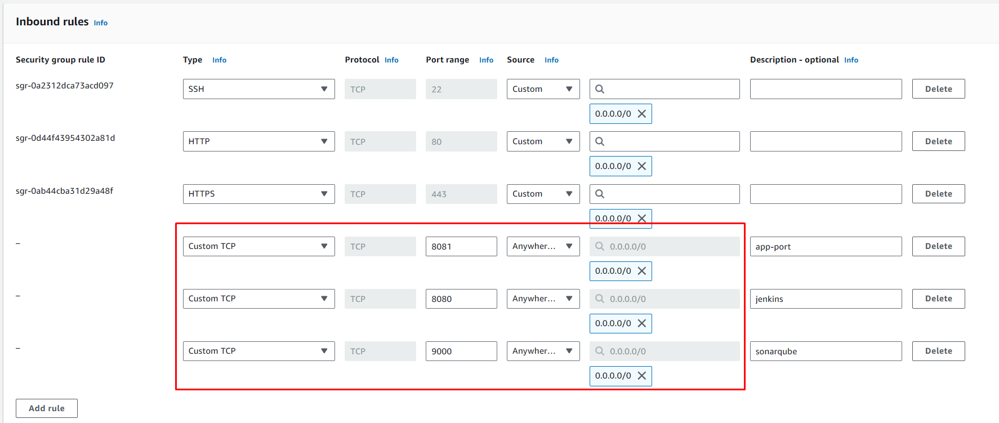

Now that your application port is open, go to your browser to access the application. Enter `<ec2-public-ip>:8081` in the address bar.

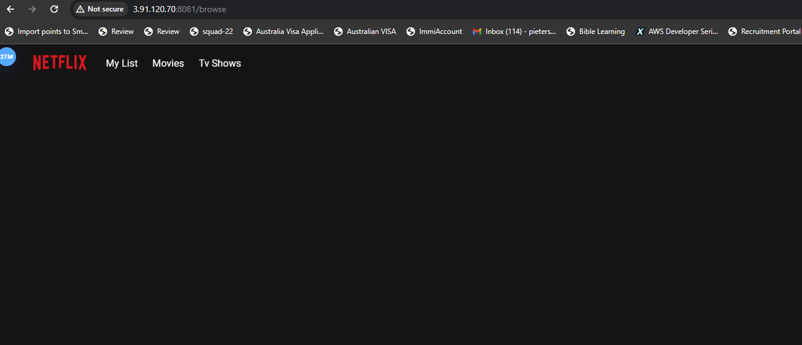


You will notice that the movies are not showing because you need an API key.

**Get the API Key:**

- Open a web browser and navigate to TMDB (The Movie Database) website.
- Click on "Login" and create an account.
- Once logged in, go to your profile and select "Settings."
- Click on "API" from the left-side panel.
- Create a new API key by clicking "Create" and accepting the terms and conditions.
- Provide the required basic details and click "Submit."
- You will receive your TMDB API key.


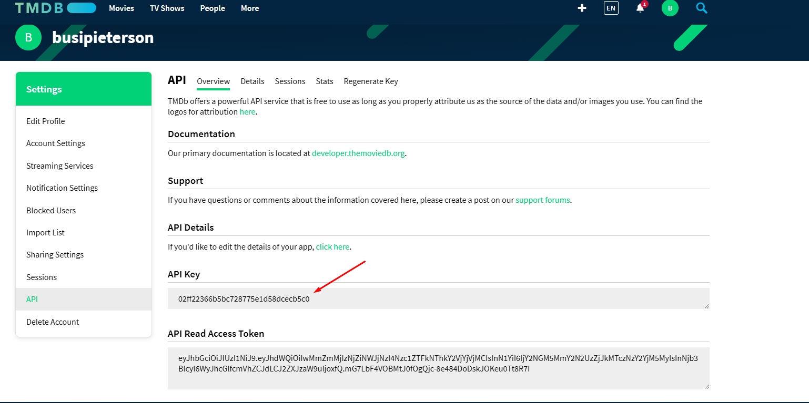

Now recreate the Docker image with your api key:

`docker build --build-arg TMDB_V3_API_KEY=<your-api-key> -t netflix .`

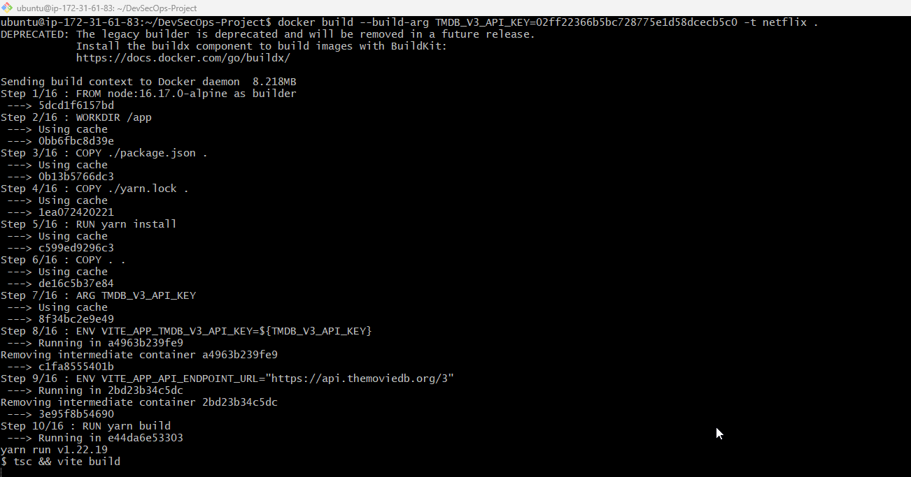

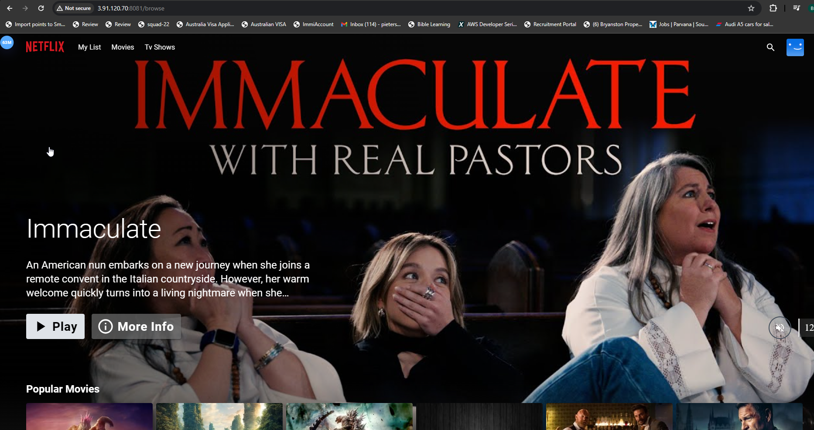

#### Install SonarQube and Trivy


Install SonarQube and Trivy on the EC2 instance to scan for vulnerabilities.

`docker run -d --name sonar -p 9000:9000 sonarqube:lts-community`


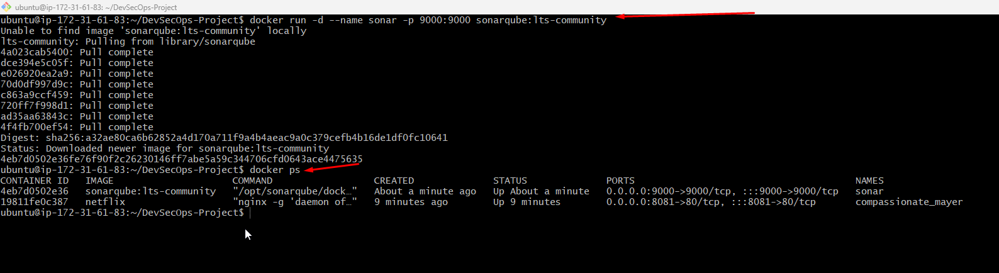

Access SonarQube in your browser.

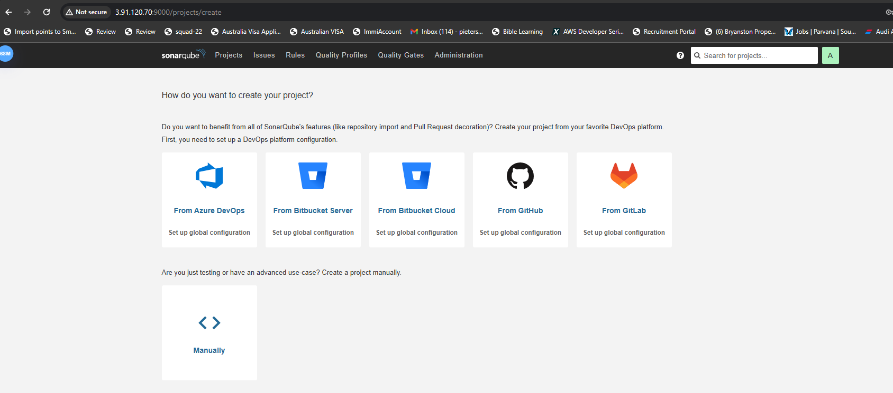

### Install Trivy
Trivy is a vulnerability scanner for containers and other artifacts like operating systems or package managers. It helps to detect vulnerabilities in these artifacts by scanning them against a database of known security vulnerabilities. Trivy can be used to enhance the security of your containerized applications by identifying potential security risks early in the development lifecycle.

```
sudo apt-get install wget apt-transport-https gnupg lsb-release
wget -qO - https://aquasecurity.github.io/trivy-repo/deb/public.key | sudo apt-key add -
echo deb https://aquasecurity.github.io/trivy-repo/deb $(lsb_release -sc) main | sudo tee -a /etc/apt/sources.list.d/trivy.list
sudo apt-get update
sudo apt-get install trivy        
```

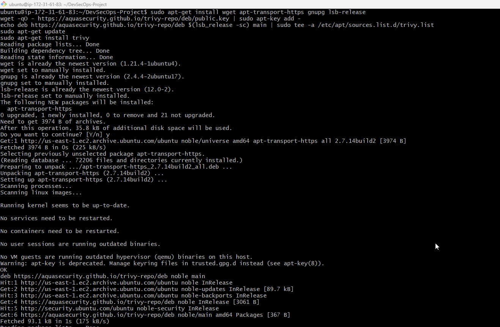

to scan image using trivy

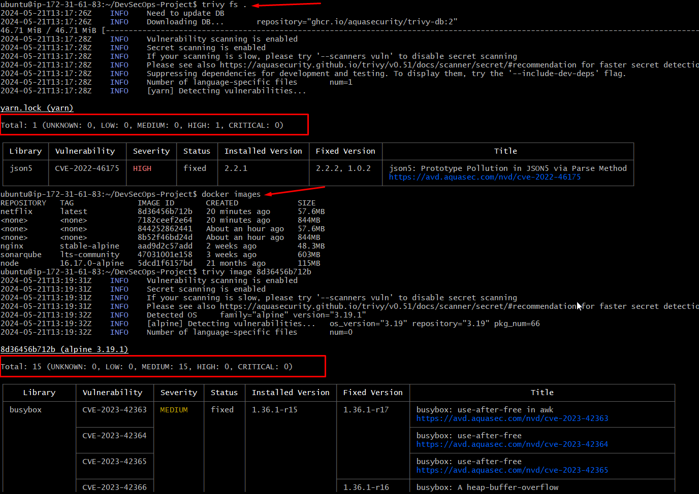

### Install Jenkins for Automation

Now its time to install Jenkins, The integration of Jenkins with SonarQube helps teams maintain code quality standards and identify and address potential issues early in the development process.

Install Jenkins on the EC2 instance to automate deployment:

```
sudo apt update
sudo apt install fontconfig openjdk-17-jre
java -version
openjdk version "17.0.8" 2023-07-18
OpenJDK Runtime Environment (build 17.0.8+7-Debian-1deb12u1)
OpenJDK 64-Bit Server VM (build 17.0.8+7-Debian-1deb12u1, mixed mode, sharing)

#jenkins
sudo wget -O /usr/share/keyrings/jenkins-keyring.asc \
https://pkg.jenkins.io/debian-stable/jenkins.io-2023.key
echo deb [signed-by=/usr/share/keyrings/jenkins-keyring.asc] \
https://pkg.jenkins.io/debian-stable binary/ | sudo tee \
/etc/apt/sources.list.d/jenkins.list > /dev/null
sudo apt-get update
sudo apt-get install jenkins
sudo systemctl start jenkins
sudo systemctl enable jenkins
```

To check if Jenkins is running, you can use the following command: `sudo service jenkins status`

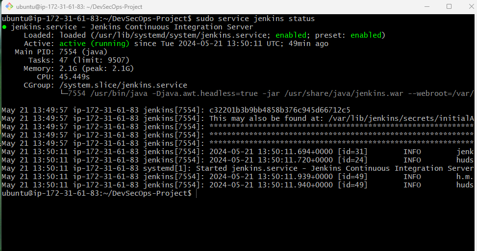

Open Jenkins in your browser by navigating to `<ec2-public-ip>:8080` and copy the command `cat /var/lib/jenkins/secrets/initialAdminPassword` to retrieve your Jenkins administrator password.

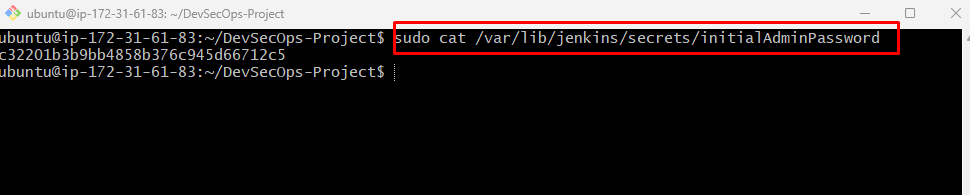

### Install Necessary Plugins in Jenkins

*Go to Manage Jenkins → Plugins → Available Plugins →*

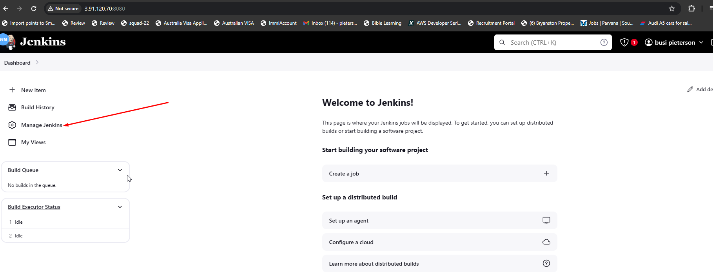

**Install below plugins**

1. Eclipse Temurin Installer (Install without restart)

2. SonarQube Scanner (Install without restart)

3. NodeJs Plugin (Install Without restart)

4. Email Extension Plugin

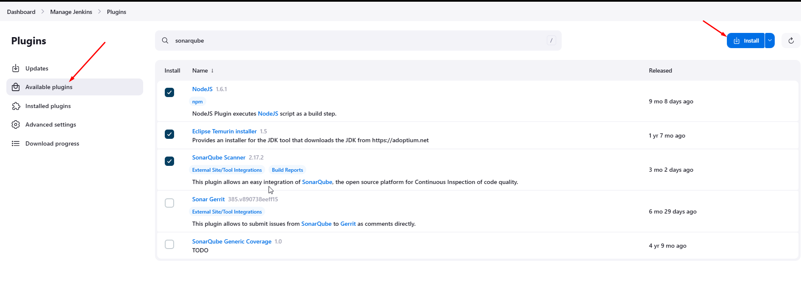


### Configure Java and Nodejs in Global Tool Configuration

*Go to Manage Jenkins → Tools → Install JDK(17) and NodeJs(16)→ Click on Apply and Save*

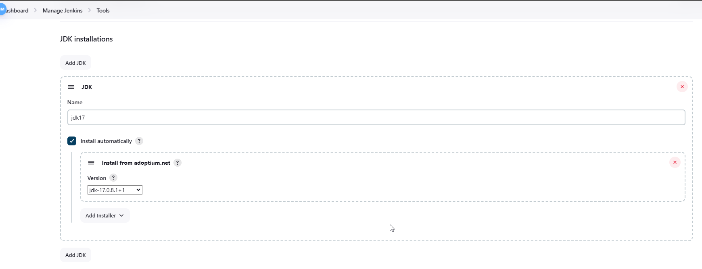

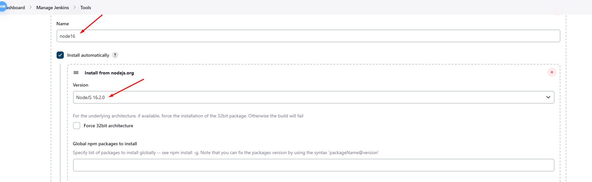

###  Create SonarQube Token

*Go to Jenkins Dashboard → Manage Jenkins → Credentials → Add Secret Text*. It should look like this.

After adding sonar token

Click on Apply and Save

The Configure System option is used in Jenkins to configure different server

Global Tool Configuration is used to configure different tools that we install using Plugins

We will install a sonar scanner in the tools.

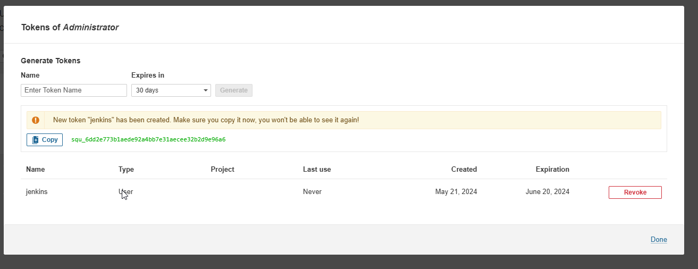


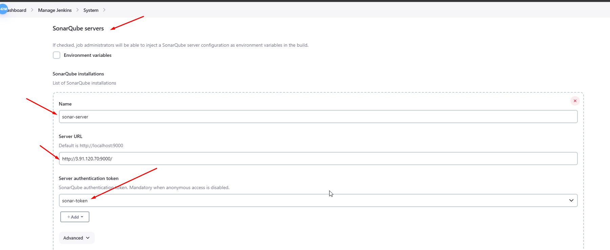

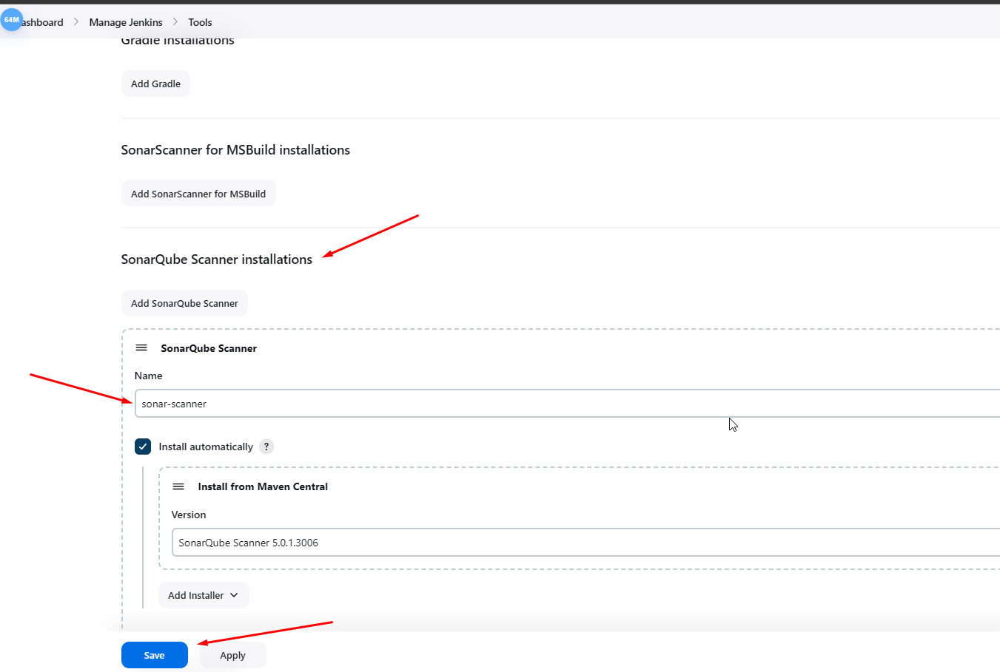

### Create a Jenkins webhook


Create a CI/CD pipeline in Jenkins to automate your application deployment.

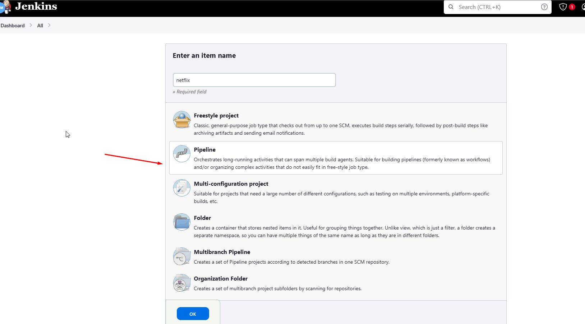

Create a Jenkinsfile and define your pipeline within it.


Now, run your Jenkins pipeline and monitor SonarQube status to ensure your code meets quality and security standards.

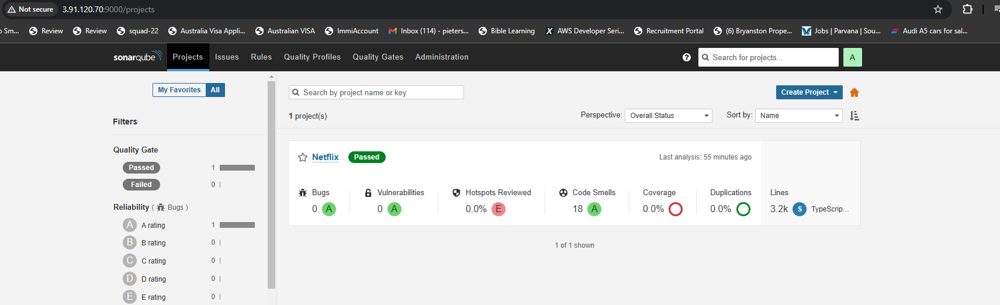

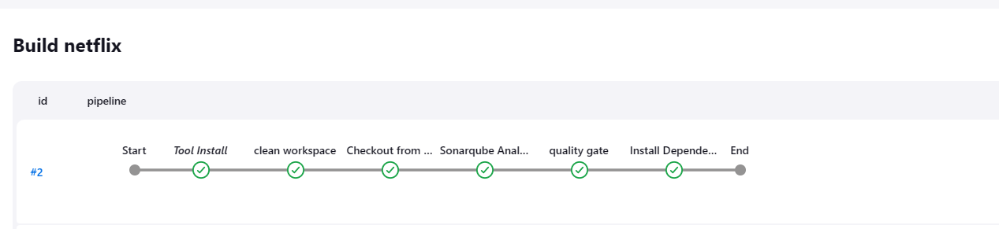

**Next, install Dependency-Check and Docker Tools in Jenkins, follow these steps:**

1. Go to the "Dashboard" in your Jenkins web interface.
2. Navigate to "Manage Jenkins" → "Manage Plugins."
3. Click on the "Available" tab and search for "OWASP Dependency-Check."
4. Check the checkbox for "OWASP Dependency-Check" and click on the "Install without restart" button.

**Configure Dependency-Check Tool:**

1. After installing the Dependency-Check plugin, configure the tool.
2. Go to "Dashboard" → "Manage Jenkins" → "Global Tool Configuration."
3. Find the section for "OWASP Dependency-Check."
4. Add the tool's name, e.g., "DP-Check."
5. Save your settings.

**Install Docker Tools and Docker Plugins:**

- Go to "Dashboard" in your Jenkins web interface.
- Navigate to "Manage Jenkins" → "Manage Plugins."
- Click on the "Available" tab and search for "Docker."
- Check the following Docker-related plugins:
    - Docker
    - Docker Commons
    - Docker Pipeline
    - Docker API
    - docker-build-step
- Click on the "Install without restart" button to install these plugins.


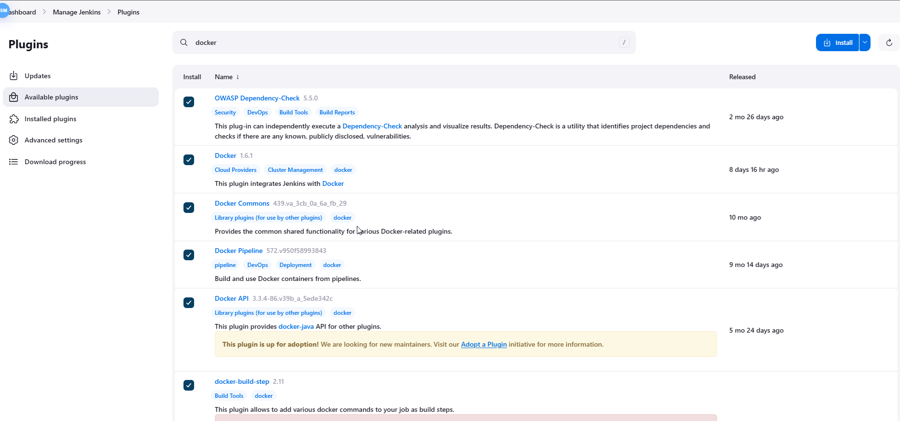

**Add DockerHub Credentials:**

- To securely handle DockerHub credentials in your Jenkins pipeline, follow these steps:
- Go to "Dashboard" → "Manage Jenkins" → "Manage Credentials."
- Click on "System" and then "Global credentials (unrestricted)."
- Click on "Add Credentials" on the left side.
- Choose "Secret text" as the kind of credentials.
- Enter your DockerHub credentials (Username and Password) and give the - credentials an ID (e.g., "docker").
- Click "OK" to save your DockerHub credentials.

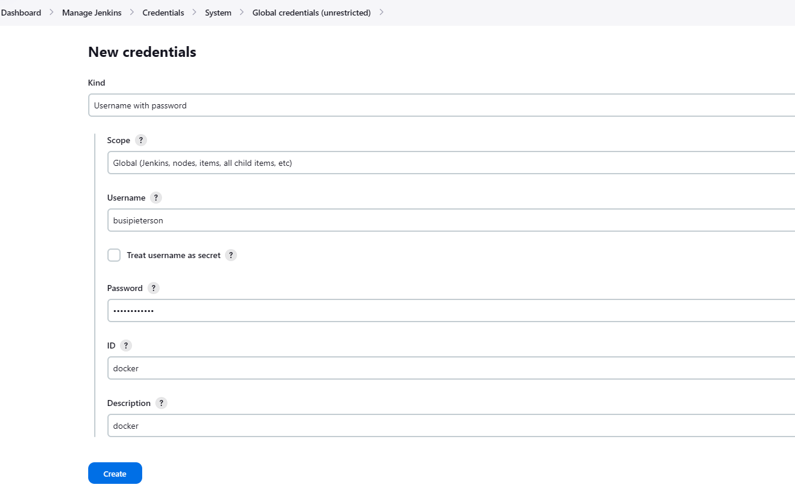

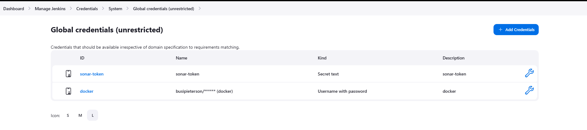

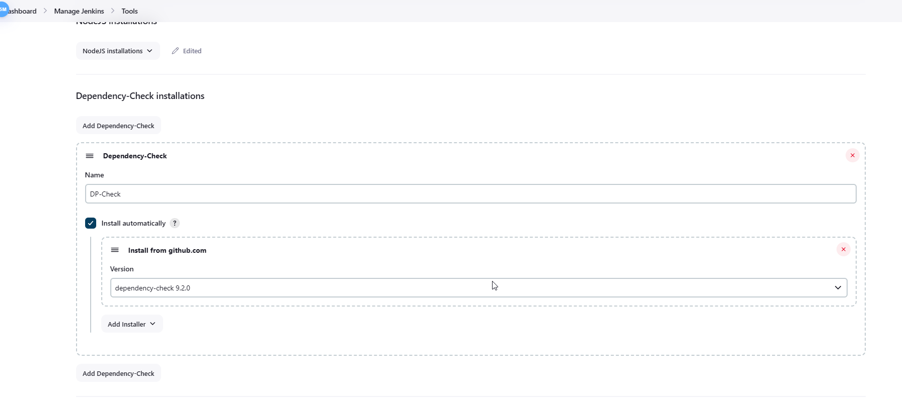

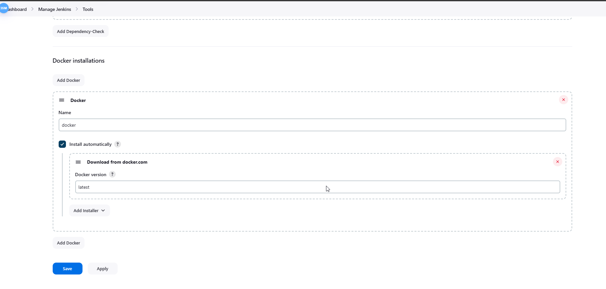

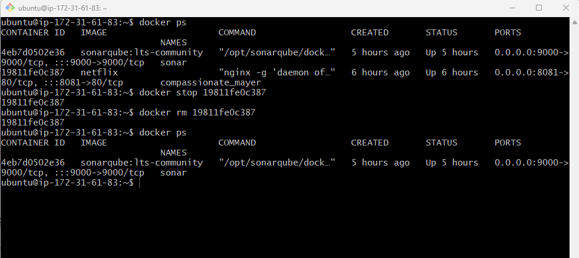

Now, you have installed the Dependency-Check plugin, configured the tool, and added Docker-related plugins along with your DockerHub credentials in Jenkins. You can now proceed with configuring your Jenkins pipeline to include these tools and credentials in your CI/CD process.

```

pipeline{
    agent any
    tools{
        jdk 'jdk17'
        nodejs 'node16'
    }
    environment {
        SCANNER_HOME=tool 'sonar-scanner'
    }
    stages {
        stage('clean workspace'){
            steps{
                cleanWs()
            }
        }
        stage('Checkout from Git'){
            steps{
                git branch: 'main', url: 'https://github.com/N4si/DevSecOps-Project.git'
            }
        }
        stage("Sonarqube Analysis "){
            steps{
                withSonarQubeEnv('sonar-server') {
                    sh ''' $SCANNER_HOME/bin/sonar-scanner -Dsonar.projectName=Netflix \
                    -Dsonar.projectKey=Netflix '''
                }
            }
        }
        stage("quality gate"){
           steps {
                script {
                    waitForQualityGate abortPipeline: false, credentialsId: 'Sonar-token' 
                }
            } 
        }
        stage('Install Dependencies') {
            steps {
                sh "npm install"
            }
        }
        stage('OWASP FS SCAN') {
            steps {
                dependencyCheck additionalArguments: '--scan ./ --disableYarnAudit --disableNodeAudit', odcInstallation: 'DP-Check'
                dependencyCheckPublisher pattern: '**/dependency-check-report.xml'
            }
        }
        stage('TRIVY FS SCAN') {
            steps {
                sh "trivy fs . > trivyfs.txt"
            }
        }
        stage("Docker Build & Push"){
            steps{
                script{
                   withDockerRegistry(credentialsId: 'docker', toolName: 'docker'){   
                       sh "docker build --build-arg TMDB_V3_API_KEY=<yourapikey> -t netflix ."
                       sh "docker tag netflix nasi101/netflix:latest "
                       sh "docker push nasi101/netflix:latest "
                    }
                }
            }
        }
        stage("TRIVY"){
            steps{
                sh "trivy image nasi101/netflix:latest > trivyimage.txt" 
            }
        }
        stage('Deploy to container'){
            steps{
                sh 'docker run -d --name netflix -p 8081:80 nasi101/netflix:latest'
            }
        }
    }
}


If you get docker login failed errorr

sudo su
sudo usermod -aG docker jenkins
sudo systemctl restart jenkins


```

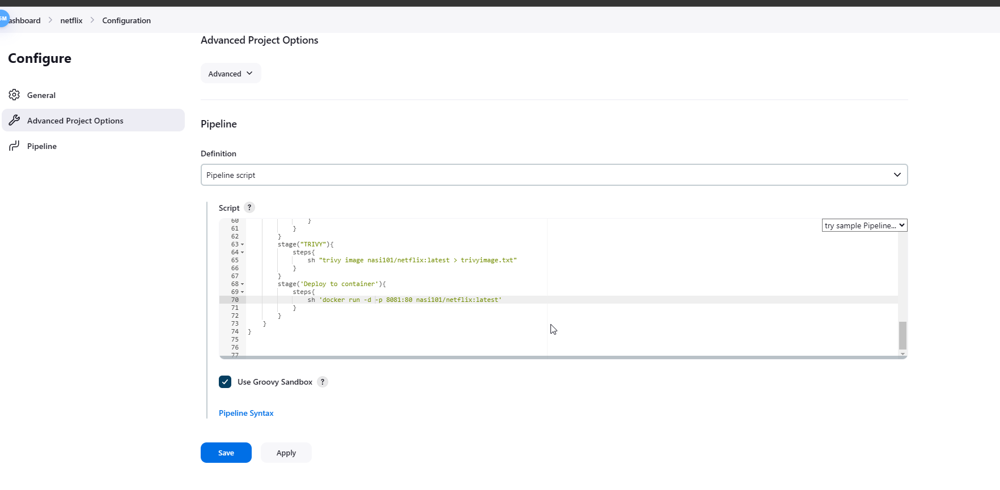

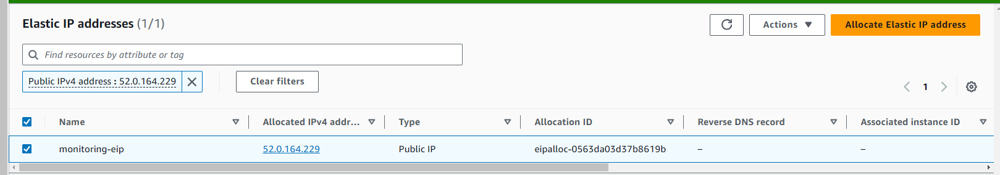

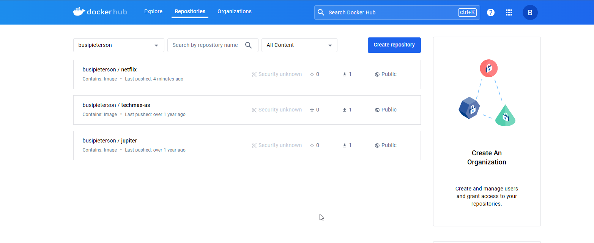

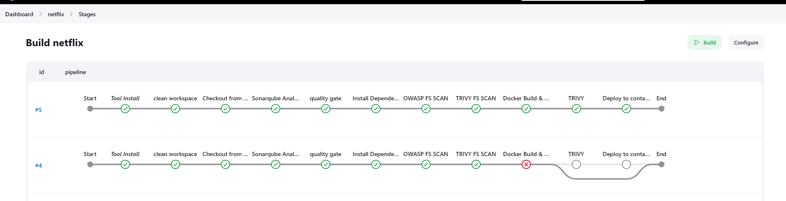

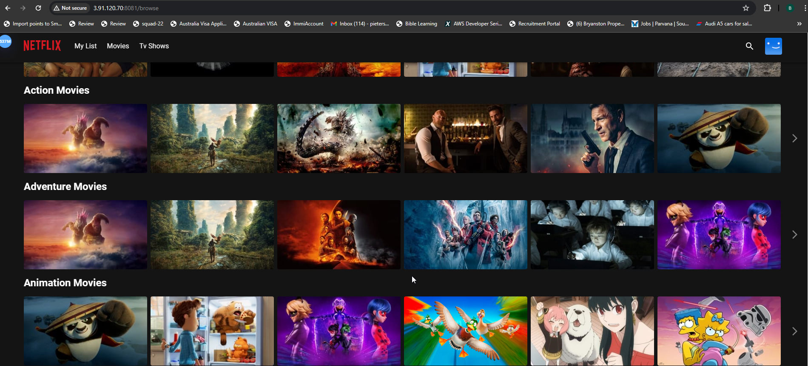

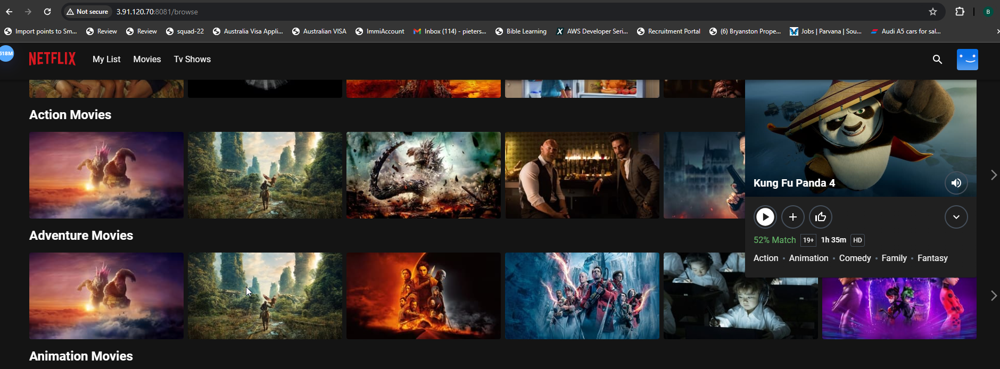

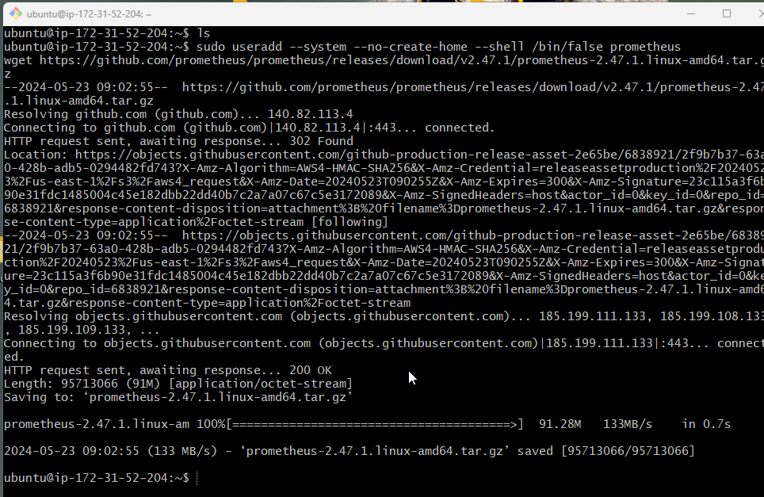

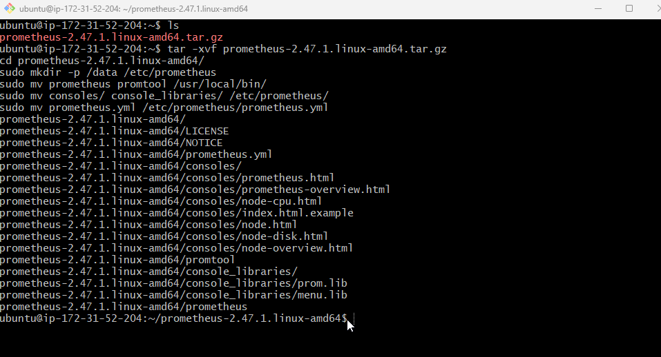

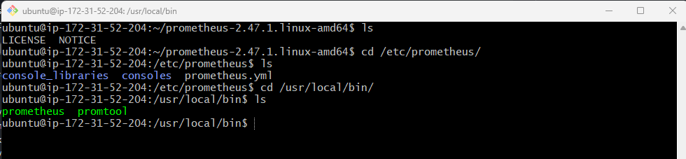


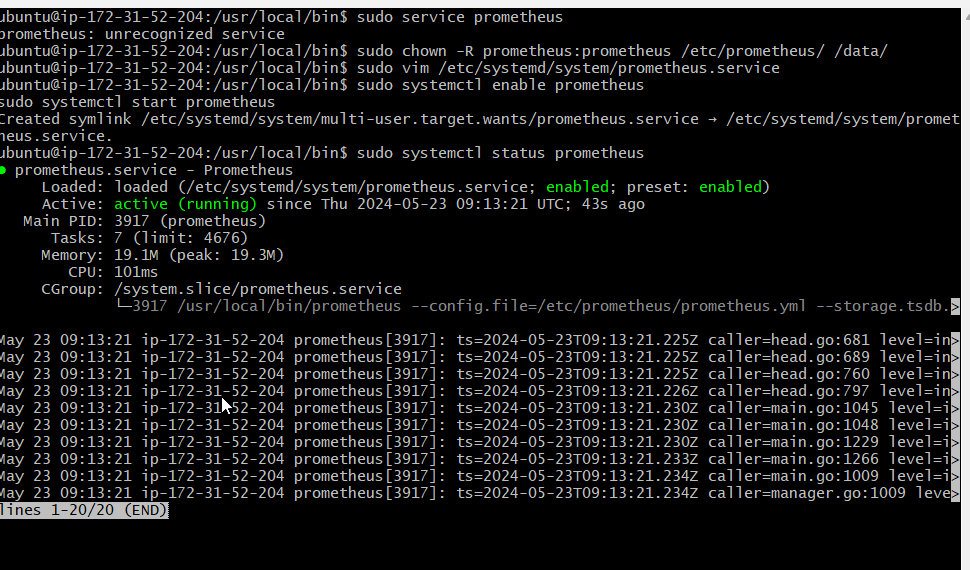

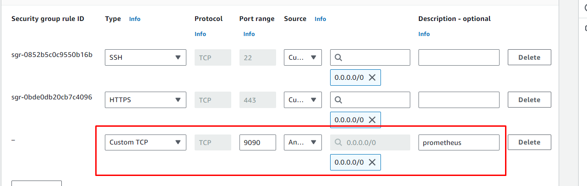

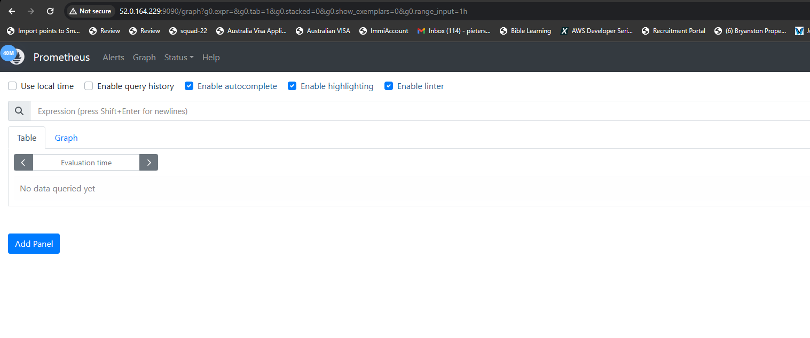

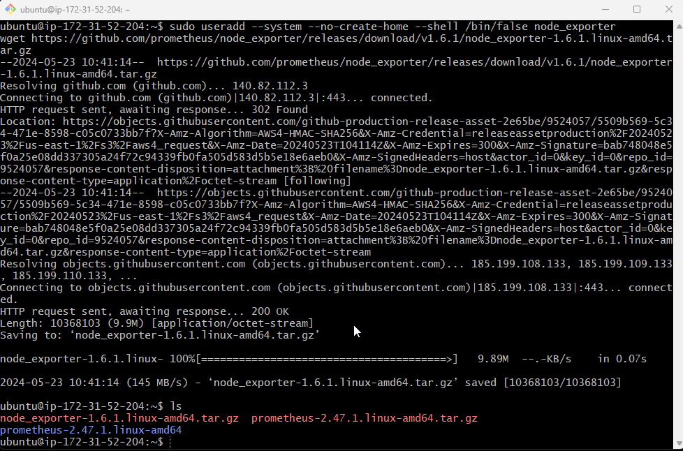

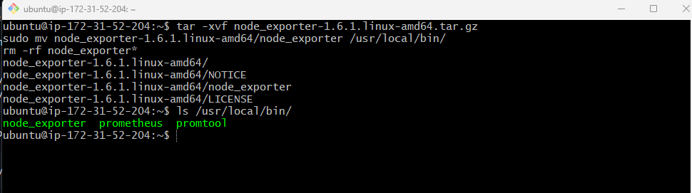

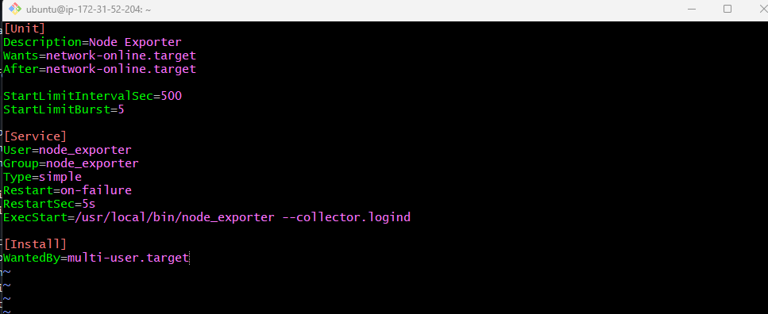


